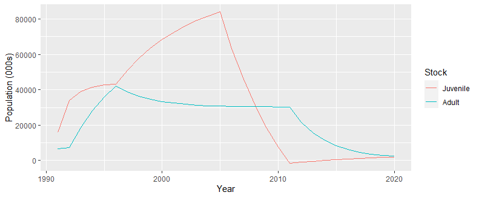
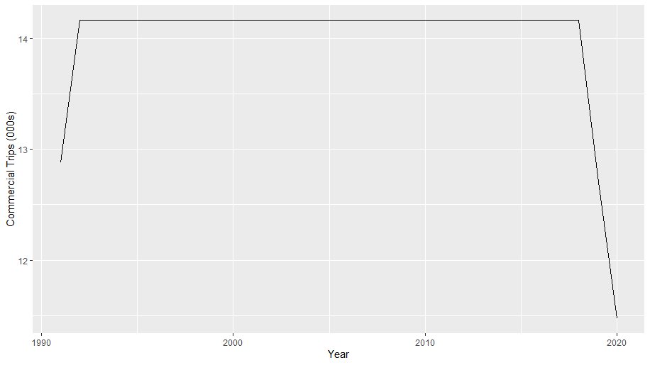
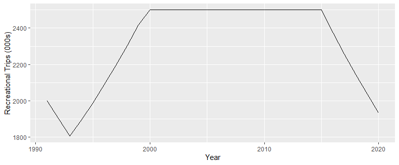
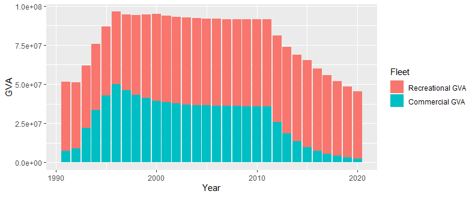

# FiRAM

FiRAM (Fisheries Resource Allocation Model) is an R package to simulate biological and economic processes of commercial and recreational fisheries. The model was initially developed by Tidbury et al. (2021) for use in Sea Bass fisheries, however the tools presented here are general purpose and can be applied to any fishery where simultaneous management of commercial and recreational fleets is required.

## Installation
You can install the development version of FiRAM using the `devtools` package:
``` r
library(devtools)
install_github("CefasRepRes/FiRAM")
```

## Example

To get started with `FiRAM`, the `"seabass"` dataset contained in the package contains the `BioeconomicParams` object encapsulating the parameters for the Sea Bass fishery studied in Tidbury et al. (2021). This can be loaded in and a simulation run as follows:

``` r
library(FiRAM)
#Load in the params for Sea Bass in the North Sea
data("seabass")
#Change the adult mortality parameter by changing the slot in params.
params@muA <- 0.1
# Specify recruitment as 15 years of high recruitment followed by 15 years of low recruitment
recruitment <- c(rep(23151200, 15), rep(757600, 15))
#Run a simulation
sim <- project(params, R = recruitment, t_start = 1991, t_end = 2020)
```
The `project()` function returns a `BioeconomicSim` object encapsulating the model results. We can call plotting functions on this object to explore the various predictions of the model.

The `plotStock()` function gives the stock sizes of the adult and juvenile stocks over the duration of the simulation.
``` r
plotStock(sim)
```


The `plotActivity()` function plots the number of trips each year for the commercial or recreational fleets. 
``` r
plotActivity(sim, fleet = "C") # The commercial fleet activity
plotActivity(sim, fleet = "R") # The recreational fleet activity
```



Finally, the `plotEconomicImpact()` function plots the GVA of each fleet for each year.

``` r
plotEconomicImpact(sim, fleet = "T") # Plot the total GVA across both fleets.
```



# References
Tidbury, Hannah J, Angela Muench, Philip D Lamb, and Kieran Hyder. 2021. “Balancing Biological and Economic Goals in Commercial and Recreational Fisheries: Systems Modelling of Sea Bass Fisheries.” *ICES Journal of Marine Science* 78: 1793–1803.
